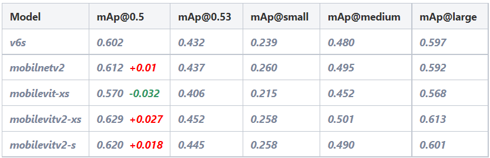
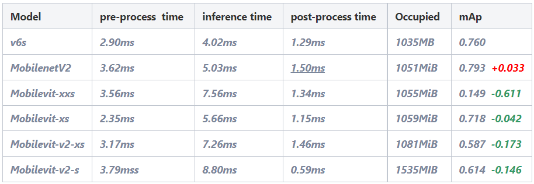
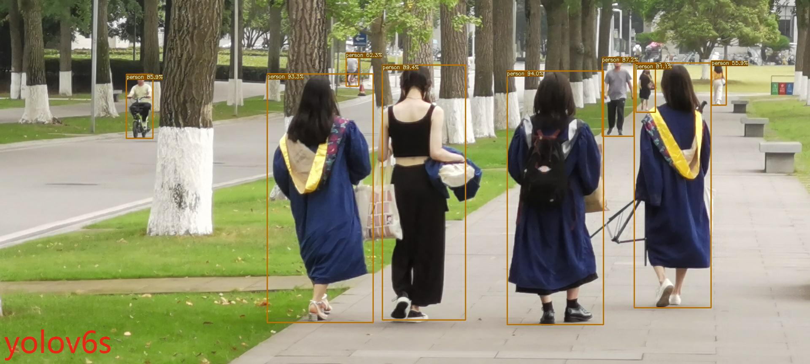
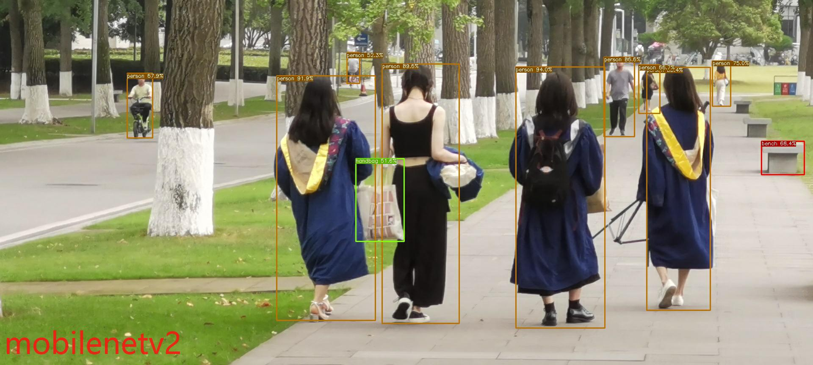
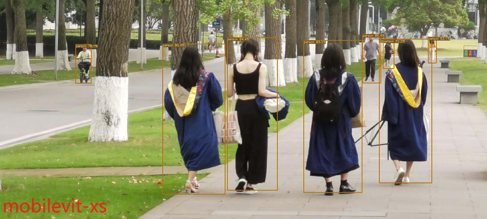
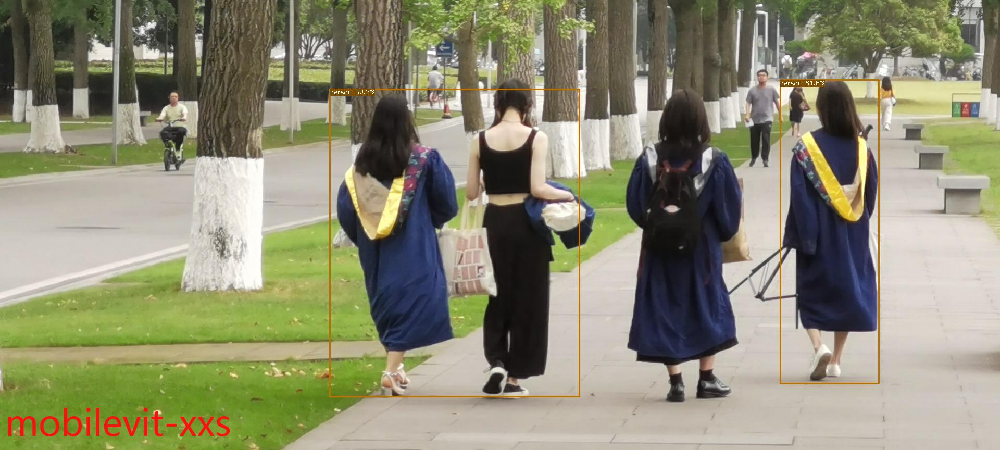
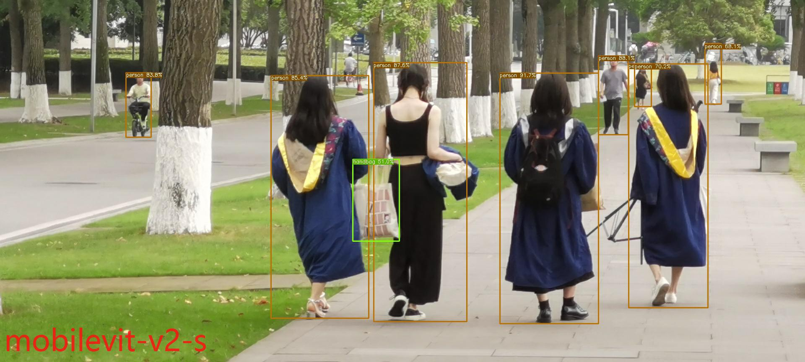

# Mobile and Anchor-free by M.Q

## Introduction
This project is based on the Yolov6 and Mobilevit architectures.
Special thanks to the two authors (https://github.com/meituan/YOLOv6) and (https://github.com/apple/ml-cvnets).
It connects the Transformer model's MobileNet network to the anchor-free head network of the Yolov6 model.
The goal is to replace the 'Repvgg' backbone of Yolov6 with smaller models such as MobileNet and Mobilevit to improve accuracy and inference speed.

### Environment Setup
Detailed environment setup is provided in the requirements.txt file. Install the requirements using the following command:
```shell
pip install -r requirements.txt
```

### Training Module

Single GPU training:
```shell
python tools/train.py --batch 32 --conf configs/yolov6s.py --data data/coco.yaml --device 0
```

Multi-GPU training (requires DDP module):
```shell
python -m torch.distributed.launch --nproc_per_node 8 tools/train.py --batch 256 --conf configs/yolov6s.py --data data/coco.yaml --device 0,1,2,3,4,5,6,7
```

<details>
<summary>Training on COCO dataset</summary>

For the nano model:
```shell
python -m torch.distributed.launch --nproc_per_node 4 tools/train.py \
                                    --batch 128 \
                                    --conf configs/yolov6n.py \
                                    --data data/coco.yaml \
                                    --epoch 300 \
                                    --device 0,1,2,3 \
                                    --name yolov6n_coco
```

For the small/tiny models:
```shell
python -m torch.distributed.launch --nproc_per_node 8 tools/train.py \
                                    --batch 256 \
                                    --conf configs/yolov6s.py \ # configs/yolov6t.py
                                    --data data/coco.yaml \
                                    --epoch 400 \
                                    --device 0,1,2,3,4,5,6,7 \
                                    --name yolov6s_coco # yolov6t_coco
```

For the mobilenetv1/v2/vit/vitv2 models:
```shell
python -m torch.distributed.launch --nproc_per_node 8 tools/train.py \
                                    --batch 256 \
                                    --conf configs/yolov6s_mobile.py \ # configs/yolov6s_mobilev2.py # configs/yolov6s_mobilevit_xxs.py
                                    --data data/coco.yaml \
                                    --epoch 400 \
                                    --device 0,1,2,3,4,5,6,7 \
                                    --name yolov6s_mobilev1_coco # yolov6s_mobilev2_coco # yolov6s_mobilevit_coco
```

For the medium/large models:
```shell
# Step 1: Train a pre-trained model
python -m torch.distributed.launch --nproc_per_node 8 tools/train.py \
                                    --batch 256 \
                                    --conf configs/yolov6m.py \ # configs/yolov6l.py
                                    --data data/coco.yaml \
                                    --epoch 300 \
                                    --device 0,1,2,3,4,5,6,7 \
                                    --name yolov6m_coco # yolov6l_coco
                                    
# Step 2: Perform self-distillation training
python -m torch.distributed.launch --nproc_per_node 8 tools/train.py \
                                    --batch 256 \ # 128 for

 distillation of yolov6l
                                    --conf configs/yolov6m.py \ # configs/yolov6l.py
                                    --data data/coco.yaml \
                                    --epoch 300 \
                                    --device 0,1,2,3,4,5,6,7 \
                                    --distill \
                                    --pretrain_model_path runs/train/yolov6m_coco/weights/best_ckpt.pt \ # yolov6l_coco
                                    --name yolov6m_coco # yolov6l_coco
```
</details>

- Configuration File: Choose a configuration file for training or configure specific networks/weights/hyperparameters.
- Data File: You can choose to use the COCO dataset (http://cocodataset.org) and configure the labels file (https://github.com/meituan/YOLOv6/releases/download/0.1.0/coco2017labels.zip).
  For other training datasets, you can modify the paths in the data.yaml file.
- Ensure that the data is organized in the following format:
```
├── coco
│   ├── annotations
│   │   ├── instances_train2017.json
│   │   └── instances_val2017.json
│   ├── images
│   │   ├── train2017
│   │   └── val2017
│   ├── labels
│   │   ├── train2017
│   │   ├── val2017
│   ├── LICENSE
│   ├── README.txt
```
<details>
<summary>Resume Training</summary>
If the training process is unexpectedly interrupted, you can resume training using the following steps:

```shell
# Multi-GPU training
python -m torch.distributed.launch --nproc_per_node 8 tools/train.py --resume
```

You can also specify a specific checkpoint file to resume training:

```shell
# Replace /path/to/your/checkpoint/path with the desired checkpoint file path.
--resume /path/to/your/checkpoint/path
```

</details>

### Testing Module
For Yolov6 and MobileNet models:
```shell
python tools/eval.py --weights yolov6s.pt --data data/coco.yaml --device 0 --batch-size 32
```

For Mobilevit models, adjust the input image size to (640, 640):
```shell
python tools/eval.py --preprocess_img --weights yolov6s_mobilevit_xxs.pt --data data/coco.yaml --device 0 --batch-size 32
```

### Inference Module
For Yolov6 and MobileNet models:
```shell
python tools/infer.py --weights yolov6s.pt --source data/images
```

For Mobilevit models, fix the input image size to (640, 640):
```shell
python tools/infer.py --weights yolov6s_mobilevit_xxs.pt --source data/images --vit
```

### Docker Module
You can directly pull the Docker image from (https://hub.docker.com/):
```shell
docker pull maoqijinwanzao3/pytorch:mobilevit-yolov6-py3.8-torch11.0-cu113
```

### Quantized Inference Module (C++)
Navigate to deploy/Tensorrt. For detailed instructions, refer to the README.md file in that folder.

### Experimental Results (Partial)

#### mAP Comparison
<div align="center">
    <a href="./">
        
    </a>
</div>

#### TRT Quantized Inference Comparison
<div align="center">
    <a href="./">
        
    </a>
</div>

#### Inference Results (Partial)
<div align="center">
    <a href="./">
        
	
        
    </a>
</div>
<div align="center">
    <a href="./">
        
        
        
    </a>
</div>
